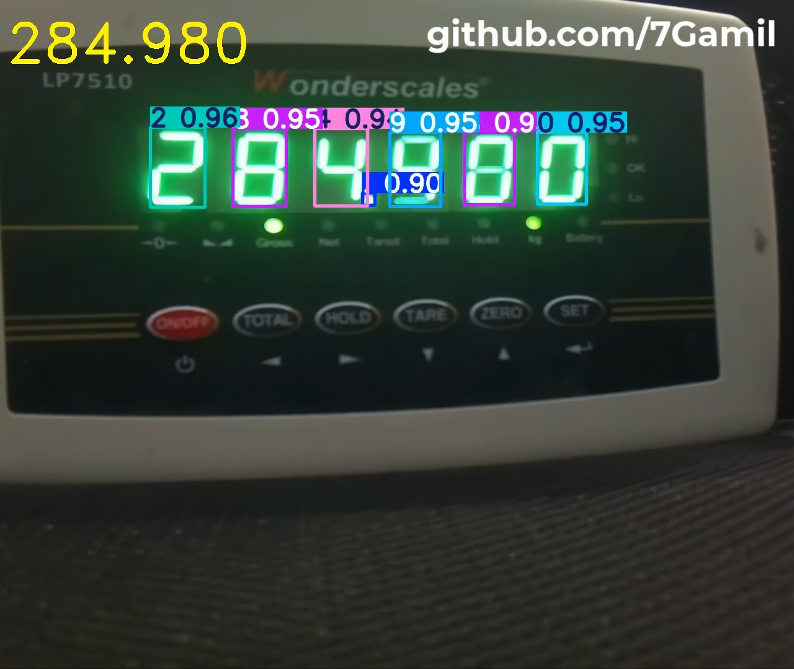

# YOLOv11 7-Segment Weight scales Reading (LP7510 - LP7516) `21/01/2025`
## Brief
Trained YOLOv11s on 30k grayscale images to read 7-Segment displays on weight scales.

### showcase image


### showcase video
The full video here: `Data/result/result_video_LP7510.mp4`

https://github.com/user-attachments/assets/1b8fb2fd-617e-4ff1-b674-5afdb98aa3a7


## Training or Inference with the model in Grayscale.
To train or perform inference with the model in grayscale, you need to modify your Ultralytics library.

- Follow this tutorial: [YOLO grayscale training Medium](https://medium.com/@ing.mauricioglez1409/yolo-grayscale-training-b3a3b46dec5f) or  [YOLO grayscale training GitHub](https://github.com/Mauricio-Gonzalez-Ortiz/ultralytics) by [https://github.com/Mauricio-Gonzalez-Ortiz](Mauricio González Ortiz).
<br/>
- Alternatively, you can use the provided modified Ultralytics library directly. Unzip `library/ultralytics 8.3.58 grayscale.zip` and replace the `ultralytics` folder in your Python virtual environment path: `/{your python virtual environment name}/lib/python3.12/site-packages/ultralytics`.

## training phase
The model was trained using the following YOLO CLI command
```bach
yolo detect train data={images folder}/data.yaml model=yolov11s.pt imgsz=640 time=4 cache=true device=0 workers=16 plots=true patience=50 ch=1
```
## Prerequisites
Install Required libraries
```bach
pip install -r requirments.txt
``` 

## Model and model benchmark
in folder `Model`.

## Training Data 30k LP7510 images (1.5 GB size)
`Data/train/30k LP7510 images in YOLOv11 format.zip` file.
Roboflow: [7Gmail LP7510](https://app.roboflow.com/7gamil/lp7510-numbers-ocr-fc1cv/1).

## How to use
See the examples in the `code.ipynb` file for:
1. Predict video
2. Predict image
3. Live camera
