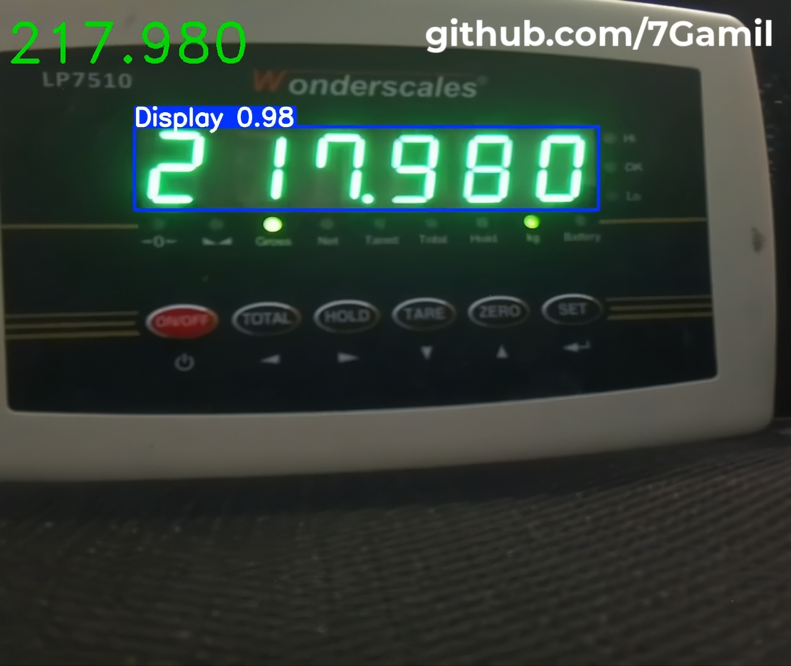

# YOLOv11 ROI and Tesseract OCR for Reading 7-Segment Weight Scales (LP7510 - LP7516) `25/01/2025`
## Brief
Trained YOLOv11n on 30k grayscale images to detect regions of interest (ROIs) containing 7-Segment displays on weight scales. then used the pretrained Tesseract OCR model to recognize 7-Segment numbers in the detected ROIs.

### showcase image


### showcase video
The full video here: `Data/result/result_video_ROI_LP7510.mp4`

https://github.com/user-attachments/assets/05ceca34-0c9e-4926-9a13-bd352b9f6bc7


## Training or Inference with the model in Grayscale.
To train or perform inference with the model in grayscale, you need to modify your Ultralytics library.

- Follow this tutorial: [YOLO grayscale training Medium](https://medium.com/@ing.mauricioglez1409/yolo-grayscale-training-b3a3b46dec5f) or  [YOLO grayscale training GitHub](https://github.com/Mauricio-Gonzalez-Ortiz/ultralytics) by [Mauricio González Ortiz](https://github.com/Mauricio-Gonzalez-Ortiz).
- Alternatively, you can use the modified Ultralytics library directly. Unzip `library/ultralytics 8.3.58 grayscale.zip` and replace the `ultralytics` folder in your Python virtual environment path: `/{your python virtual environment folder name}/lib/python3.12/site-packages/ultralytics`.

## training phase
The model was trained using the following YOLO CLI command
```bach
yolo detect train data={images folder}/data.yaml model=yolov11n.pt imgsz=640 time=4 cache=true device=0 workers=16 plots=true patience=50 ch=1
```
## Prerequisites
Install Required libraries
```bach
pip install -r requirments.txt
``` 

## YOLOv11n and Tesseract ocr models.
YOLOv11n model can be found in folder `Models/YOLOv11/`.

Tesseract OCR model can be found in folder `Models/tesseract/7seg.traineddata` by [Shreeshrii](https://github.com/Shreeshrii) in repository [tessdata ssd](https://github.com/Shreeshrii/tessdata_ssd/tree/master) copy Tesseract OCR model to Tesseract models path on Ubuntu is `\usr\share\tesseract-ocr\5\tessdata\`.

## Training Data 30k LP7510 images ROI (1.5 GB size)
<!-- `Data/train/30k LP7510 ROI images in YOLOv11 format.zip` file. -->
Available for download and use on Roboflow: [7Gmail LP7510 ROI](https://app.roboflow.com/7gamil/lp7510-numbers-roi-ocr-gia7i/4).

## How to use
See the examples in the `code.ipynb` file for:
1. Predict video
2. Predict image
3. Live camera
