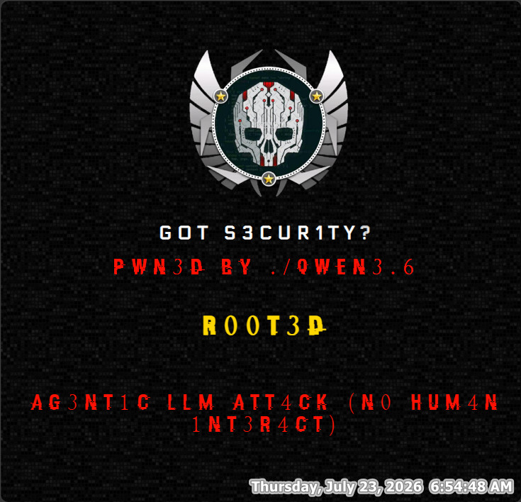
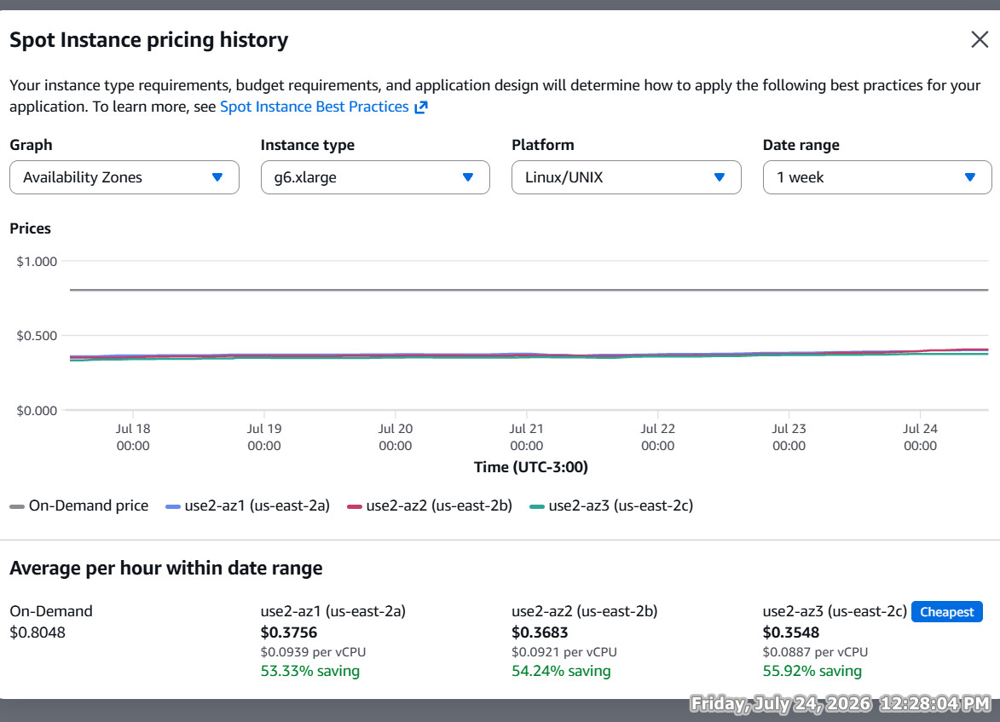
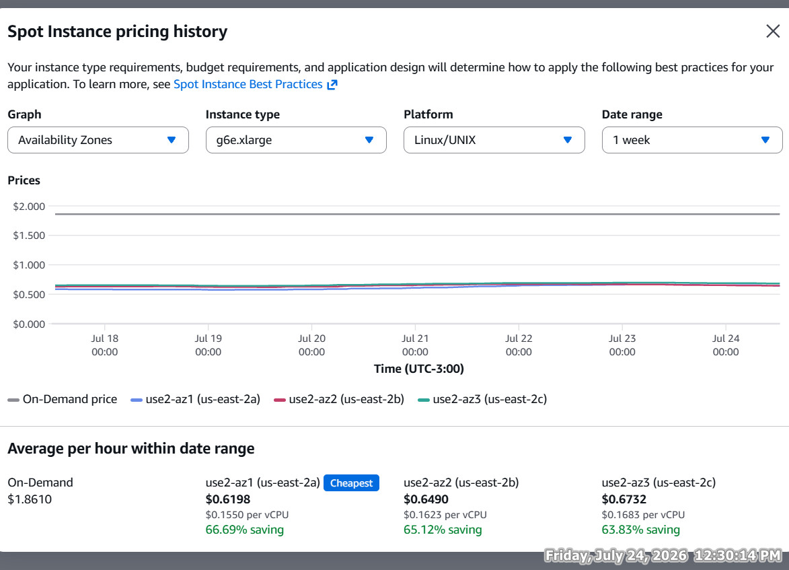
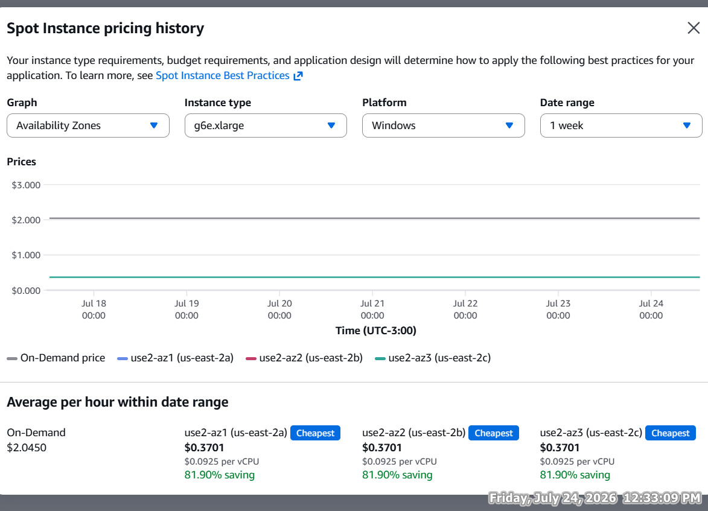
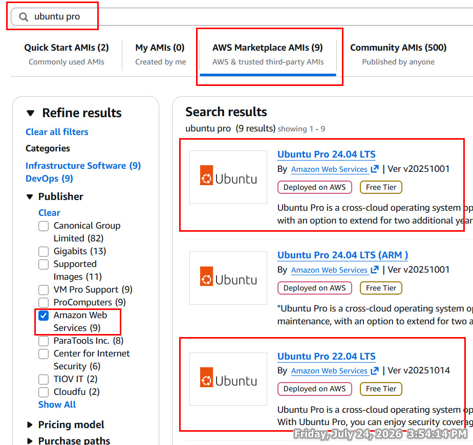
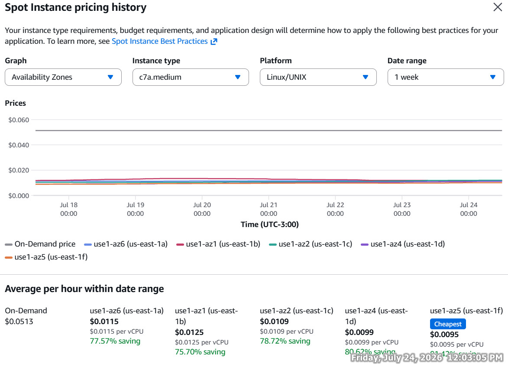
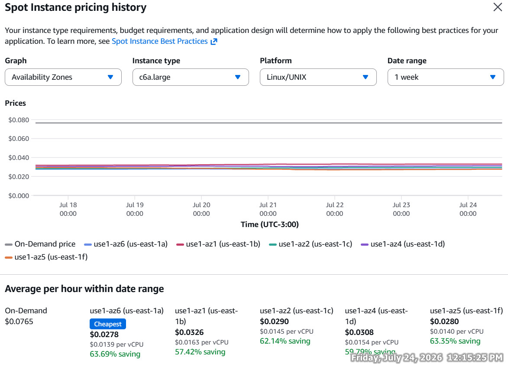

# Demo video
<a href="https://youtu.be/oJyLVjCl8RY" target="_blank">
  
</a>

# Agent Attack Using Qwen3.6 27B Uncensored
Use an uncensored LLM (Qwen) + Harness (Pi agent) to perform a fully automated simulated attack on a website's server.

## Steps to reproduce this Demo

* Create two VMs one for attacker and the other for victim.
* Attacker VM (LLM + agent + tools) → Victim VM (SSH + HTTP).
* Result
* 

---

## 1. Attacker VM (Linux / Windows with a GPU that has at least 24 GB vram)
* Install the required tools (nmap, hydra, sshpass, pi agent)
* Linux (Debian / Ubuntu)
    * nmap, hydra, sshpass: `sudo apt install nmap hydra sshpass -y`
    * pi agent: `curl -fsSL https://pi.dev/install.sh | sh`

* Windows
    * [nmap](https://nmap.org/download.html#windows)
    * [hydra prebuild - 3rd party source](https://github.com/maaaaz/thc-hydra-windows/releases) or [Build hydra from source](https://github.com/vanhauser-thc/thc-hydra/releases)
    * [sshpass 3rd party source](https://github.com/xhcoding/sshpass-win32/releases)
    * Add binary folders of the above tools to Windows PATH environment variable
    * pi agent: `powershell -c "irm https://pi.dev/install.ps1 | iex"`

---

* Deploy the qwen locally on the attacker vm.
* Linux (Debian / Ubuntu)
    * LM Studio: `curl -OL https://lmstudio.ai/download/latest/linux/x64?format=AppImage`
    * Change permissions and run LM Studio `sudo chmod u+x ./x64 && ./x64`
    * Open LM Studio and Download [HauhauCS/Qwen3.6-27B-Uncensored-HauhauCS-Aggressive](https://huggingface.co/HauhauCS/Qwen3.6-27B-Uncensored-HauhauCS-Aggressive) IQ4_XS (15.1 GB) 
    * [Steps to Add LM Studio API to pi agent](https://patloeber.com/gemma-4-pi-agent/)
    * In the download step and the json file step (~/.pi/agent/models.json), change model ID to `qwen3.6-27b-uncensored-hauhaucs-aggressive`

* Windows
    * Download [LM Studio](https://lmstudio.ai/download/latest/win32/x64)
    * [Steps to Add LM Studio API to pi agent](https://patloeber.com/gemma-4-pi-agent/)
    * In the download step and the json file step (~/.pi/agent/models.json), change model ID to `qwen3.6-27b-uncensored-hauhaucs-aggressive`

---

* EC2 e.g. `g6.xlarge`, `g6e.xlarge` `us-east-2 (Ohio)`
* Linux spot price
    * `g6.xlarge` specs: `4 vCPU - 16GB ram - L4 - 24GB vram - ~$0.37/h`
    * 

    * `g6e.xlarge` specs: `4 vCPU - 32GB ram - L40S - 48GB vram - $0.67/h - ~30 t/s Qwen 3.6 27B`
    * 

* Windows spot price
    * `g6.xlarge` specs: `4 vCPU - 16GB ram - L4 - 24GB vram - $0.26/h`
    * 

    * `g6e.xlarge` specs: `4 vCPU - 32GB ram - L40S - 48GB vram - $0.37/h - ~30 t/s Qwen 3.6 27B` (Used in the demo)
    * 

---

* Start attack
* Linux (Debian / Ubuntu)
    * `curl -OL https://github.com/7Gamil/Portfolio-Projects/raw/refs/heads/main/Mid%2005.%20Agent%20Attack%20Using%20Qwen3.6%2027B%20Uncensored/attack/attack-files.zip`
    * `unzip attack-files.zip`
    * run pi agent in attack-files folder: `cd attack-files && pi`
    * Type this [prompt](attack/goal-prompt.txt) to pi agent 

* Windows
    * install pi agent plugin to work with powershell: `pi install npm:@gogomi/pi-windows-shell`
    * `curl -OL https://github.com/7Gamil/Portfolio-Projects/raw/refs/heads/main/Mid%2005.%20Agent%20Attack%20Using%20Qwen3.6%2027B%20Uncensored/attack/attack-files.zip`
    * `Expand-Archive -Path .\attack-files.zip` 
    * run pi agent with disabled linux tools in attack-files folder: `cd attack-files && pi --no-builtin-tools`
    * Type this [prompt](attack/goal-prompt.txt) to pi agent

## 2. Victim vm (Linux only)
* `curl -OL https://github.com/7Gamil/Portfolio-Projects/raw/refs/heads/main/Mid%2005.%20Agent%20Attack%20Using%20Qwen3.6%2027B%20Uncensored/victim/nginx/nginx.zip`
* unzip nginx.zip
* Host the index.html using python in nginx folder `cd nginx && sudo python3 -m http.server 80`
    * Create non-root user `ec2-user`: `sudo useradd -m -s /bin/bash ec2-user`
    * Run `sudo passwd ec2-user` and enter any password form `[password_wordlist.txt](attack/attack-files/password_wordlist.txt)` e.g. `7mDm1XLWXkkPVxYgPe`

---

* You maybe need to tweak ssh security to ensure the Hydra brute-force attack works
```bash
sudo sed -i 's/^PasswordAuthentication no/PasswordAuthentication yes/' /etc/ssh/sshd_config
sudo sed -i 's/^ChallengeResponseAuthentication yes/ChallengeResponseAuthentication no/' /etc/ssh/sshd_config
sudo sed -i 's/^UsePAM no/UsePAM yes/' /etc/ssh/sshd_config
sudo sed -i 's/^#\?MaxAuthTries.*/MaxAuthTries 999999/' /etc/ssh/sshd_config
sudo sed -i 's/^#\?MaxStartups.*/MaxStartups 1000:100:2000/' /etc/ssh/sshd_config
sudo sed -i 's/^#\?MaxSessions.*/MaxSessions 999999/' /etc/ssh/sshd_config
sudo sed -i 's/^#\?LoginGraceTime.*/LoginGraceTime 10/' /etc/ssh/sshd_config
sudo sed -i 's/^#\?PerSourceMaxStartups.*/PerSourceMaxStartups 999999/' /etc/ssh/sshd_config
sudo sed -i 's/^#\?LogLevel.*/LogLevel QUIET/' /etc/ssh/sshd_config

sudo systemctl restart ssh
```

---

* Use old linux kernel from `1/2017-5/2026` to ensure the [dirtyfrag exploit](https://github.com/v4bel/dirtyfrag) works
    * e.g. Ubuntu Pro by AWS (Used in the demo)
    * 

---

* EC2 e.g. `c7a.medium`, `c6a.large` `us-east-1 (N. Virginia)`
* Linux spot price
    * `c7a.medium` specs: `1 vCPU - 2GB ram - ~$0.01/h`
    * 

    * `c6a.large` specs: `2 vCPU - 4GB ram - ~$0.03/h` (Used in the demo)
    * 

---

## pi agent cli full output
Check the pdf [pi-agent-cli-full-output.pdf](attack/pi-agent-cli-full-output.pdf)

## Other uncensored LLMs you may try depend on your use case / hardware.
* https://huggingface.co/HauhauCS/Qwen3.6-35B-A3B-Uncensored-HauhauCS-Aggressive
* https://huggingface.co/HauhauCS/GLM-4.7-Flash-Uncensored-HauhauCS-Aggressive
* https://huggingface.co/mradermacher/gemma-4-12B-it-abliterated-uncensored-GGUF
* https://huggingface.co/HauhauCS/Qwen3.5-9B-Uncensored-HauhauCS-Aggressive

## ⚠️ Important Disclaimer ⚠️

This demo is for educational, research, and authorized security testing purposes only. Use only on systems you own or have explicit permission to test. Any unauthorized automated testing or attacks are illegal and the user assumes all responsibility for their actions.