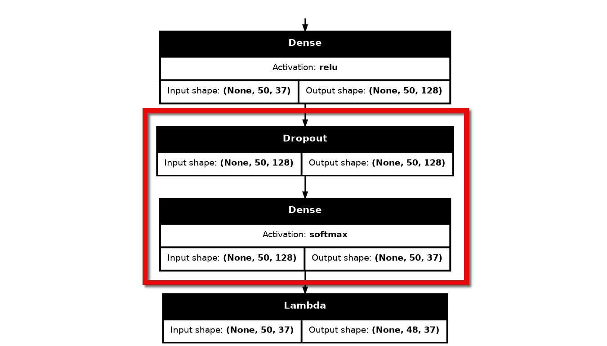

# Fine-tuning [Keras OCR](https://github.com/faustomorales/keras-ocr)
**Added** custom layers, **Adjusted** Hyperparameters, and **Frozen** some Layers to increase the model accuracy

## New Layers added

 

## Prerequisites
Before using Jupyter notebook, ensure you have installed the required libraries  
`pip install -r requirments.txt`

Please check `fine-tuning.ipynb` Jupyter file for more details.
