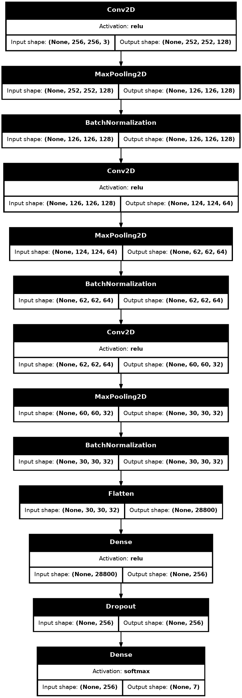

# Teeth Classification `06/02/2025`
## Brief
Teeth Classification using CNN 

## CNN architecture


## Prerequisites
### Install Required libraries
```bach
pip install -r requirments.txt
```

### Install graphviz to plot the model architecture
For Ubuntu
```bach
sudo apt-get update
sudo apt-get install graphviz
```

## Dataset 
The dataset can be found in the `Teeth Dataset.zip` file

## Pretrained  model file
The pre-trained model file `cnn_teeths.keras`.

## Please check `Teeth Classification CNN.ipynb` Jupyter file for more details.

## Fine-tuned model
The Fine-tuned model file `fine_tuned_cnn_teeths.keras`.